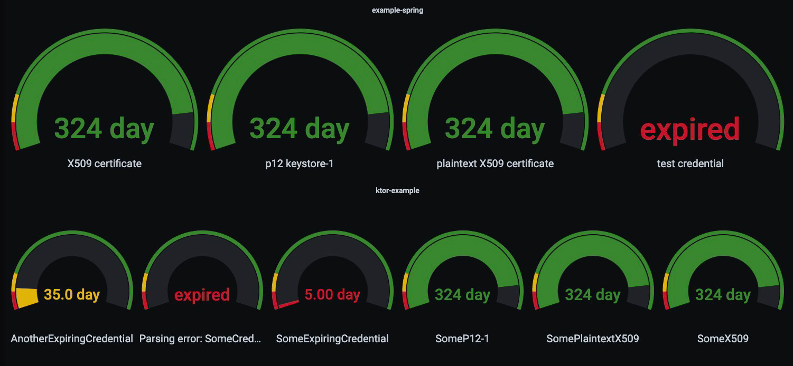

# Monitoring of certificate expirations

## Why do we need expiring certificates and why do we need to monitor them?

Transport layer security (TLS) - which is the basis for HTTPS - is probably the most prominent representation for
certificate based encryption. Encryption on application level is just a further example of its use cases. An important
part of the security mechanism of certificate based encryption is that the certificates have an expiration date and are
considered as invalid after that date.
Read [here](https://www.entrust.com/blog/2016/10/why-is-certificate-expiration-necessary/) why the expiration is
important. At the same time this expiration principle causes repeatedly problems in computer system all over the world:

- In 2020 an expired certificate
  at [Spotify](https://www.thesslstore.com/blog/the-day-the-music-died-certificate-expiration-takes-down-spotify/)
  resulted in the music streaming service to be down
- Also [Microsoft](https://www.theverge.com/2020/2/3/21120248/microsoft-teams-down-outage-certificate-issue-status) had
  problems with certificate expiration resulting in their service Microsoft Teams to be down
- Even a part of the
  German [payment sector](https://hackaday.com/2022/05/30/expired-certificate-causes-german-payment-meltdown/) was
  disturbed by an expired certificate

## What can we do to prevent the expiration of our certificates?

The best solution against the expiration is to have an automation that renews the certificates on its own. And indeed
there are multiple providers for automated certificate renewal. E.g. in a kubernetes cluster
a [cert-manager](https://cert-manager.io/docs/) monitors and renews certificates.

But of course real life projects are often far away from being ideal. It occurs in many companies that you have to deal
with certificates that can for various reasons not be automatically renewed. Just to give two examples that from
projects I have worked in:

- A customer has regulatory reasons why he is not allowed to use automated certificate generation
- You are writing an application that communicates with an external service from a different company. This company
  insists that your application is sending a client certificate signed by them (which of course is not happing in an
  automated way).

If we cannot renew our certificates automatically, we have to do it manually. Therefore, we need to keep track of the
date when the certificate expires to exchange it in time.

## How the tracking is usually implemented

Here are some examples of certificate expiration monitoring solutions I have come across so far, and why they are no
long term solution

- A page in the service documentation that keeps track of all used certificates

  This approach is very error-prone, because people forget to look at the page and don't see the expiration data at all.
  On top of that you can never be sure, that the content of the page is really true. People forget to update the page
  after adding a new certificate or even update the page, but do a mistake by updating the certificate in the service.

- Reminders in a calendar or a ticket system

  There is always the danger that a configured reminder is missed. A configured receiver may be ill or left the company.
  Maybe the message disappears in a huge ticket backlog or in a mass of sent mails. Even if a reminder is seen it can be
  understood wrongly.

- A certificate management system

  This is a more advanced solution, which still comes with some pitfalls. Such a system will probably notify
  about a certificate that is about to expire. Then the certificate will be renewed inside the management system and be
  forwarded to a service using it. But one can never be sure, that a certificate really has been updated in all
  services.
  Also people may update the certificate in the management system, but forget to update the services at all. In both
  cases the management system will display the certificate as renewed, even the certificate used in the service is about
  to expire.

## A service level based approach

All the bad examples above have one thing in common: They are not monitoring the certificate that is actually used, but
a local representation of it. And as we have seen there is no guarantee that a local representation of a certificate
really
corresponds to the certificate that is used by a running service. A solution that is much more resilient against human
errors has to be based on the following

**

The only instance that should give information about the validity of a certificate is the service using it.
**

And implementing a solution based on this thought is not a big deal. If a service depends on a certificate, it has to
have
access to it in some way and therefore can also access its expiration date. The continuous monitoring of applications
should be implemented in every company. Combining this, we can make our application communicate to the monitoring
tools which certificates it is using and when these will expire.

## Example for JVM services using Micrometer, Prometheus and Grafana

The repository [expiration-monitoring](https://github.com/fkohl04/expiration-monitoring) contains a JVM library that can
be used in any JVM service to monitor the validity of any kind of expiring artifact. The expiration dates are exposed
via Micrometer in the service metrics. These can then be picked up by Prometheus and be displayed by Grafana.

  

Once exposed, It is easily possible to implement alerting in Prometheus or Grafana based on these metrics. Having the
metrics displayed in Grafana makes the expiration as visible as possible to the whole team.
