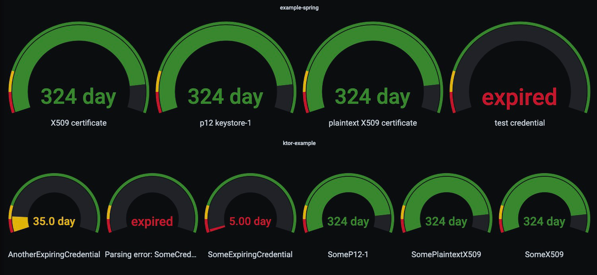

# expiration-monitoring

Monitoring of artifacts that are able to expire in a JVM service using Micrometer.

## Quickstart

The fastest way to test the functionality of this repository is to build the
two [example applications](example-applications) with gradle and deploy them to docker desktop using docker compose.
This can be achieved with the following commands:

```shell
./gradlew clean build &&
docker-compose -f example-applications/docker-compose.yml up
```

After executing the docker-compose command four containers should be running:

1. A ktor example application which uses the module [expiration-monitoring-core](expiration-monitoring-core)
2. A spring example application which uses the module [expiration-monitoring-spring](expiration-monitoring-spring)
3. A Prometheus container that monitors the two example applications
4. Grafana container that displays the metrics, collected by the Prometheus container

Open the locally started [Grafana instance](http://localhost:3000), login with the credentials `admin:admin` and you
should be able to see a dashboard containing the remaining validity of the artifacts used by the two example services.

<p align="center">
    
</p>

## Usage

This repository contains two modules. The module [expiration-monitoring-core](expiration-monitoring-core) is pure Kotlin
and can be used in any JVM based project. If you are using Spring you probably want to
use [expiration-monitoring-spring](expiration-monitoring-spring) which adds some additional Spring based features to the
core module.

Both modules result in your service to expose one additional micrometer metric specifying the remaining validity of
certain artifacts. All validities will be exposed under the same metric named `artifact.expiration`. The
tag `artifact.name`
distinguishes the validities of the different artifacts.

It is possible to add additional tags to the metric. The name of the service using the artifact is a good example for a
tag that needs to be set per service. Please see the sections of the modules to find out how.

### Using expiration-monitoring-core

The [ExpirationMonitor](expiration-monitoring-core/src/main/kotlin/ExpirationMonitor.kt) is the core of this module. It
provides functionalities to monitor the remaining validity of objects that implement the
interface [ExpiringArtifact](expiration-monitoring-core/src/main/kotlin/model/ExpiringArtifact.kt).
An `ExpiringArtifact` symbolizes an artifact that has an expiring date.

The public functions of the expiration monitor can be divided in two categories:

1. `monitorExpiringArtifact` & `monitorExpiringArtifacts` should be used if you have already initialized the artifact
   that shall be monitored. They take the artifact, monitor it and will take care that the object is not deleted by
   garbage collection.
2. `receiveArtifactSafelyAndMonitor` & `receiveArtifactsSafelyAndMonitor` should be used if you want to create artifacts
   and then monitor them. These functions have to be called with a function that produces an expiring artifact. If the
   producer function throws an
   exception the artifact will still be added to the metrics, but will be marked as expired. To make this error visible
   in Grafana and allow distinguishing to a normal expiration the artifact name will be prefixed with `Parsing Error:`.

Please see the [models directory](expiration-monitoring-core/src/main/kotlin/model) for implementations of
the `ExpiringArtifact` interface.

### Using expiration-monitoring-spring

This module enables you to execute the monitoring functionalities of the core module only by setting spring application
properties. For an example usage see the [spring example application](example-applications/spring-example).

1. Add the dependency `implementation(project(":expiration-monitoring-spring"))`
2. Configure your application to scan the packages of this dependency for spring configurations and components
    ```kotlin
    @ConfigurationPropertiesScan("expiration.monitoring.spring.configuration")
    @ComponentScan("expiration.monitoring.spring.configuration")
    class SpringExampleApplication
   ```
3. Add configuration properties to your application to specify which artifacts shall be monitored. See the following
   subsections for explanations on the possible configuration values. For details see the
   corresponding [properties file](expiration-monitoring-spring/src/main/kotlin/expiration/monitoring/spring/configuration/properties/ExpirationMonitoringProperties.kt)

#### Additional metric tags

```yaml
expiration.monitoring:
  globalTags:
    - key: "Tag key"
      value: "Tag value"
```

#### PKCS12 stores

```yaml
expiration.monitoring:
  pkcs12Stores:
    - name: "Name of p12 keystore"
      location: "Path to keystore"
```

#### X509 Certificates

```yaml
expiration.monitoring:
  x509Certificates:
    - name: "Name of X509 certificate"
      location: "Path to certificate"
```

#### Plaintext X509 Certificates

```yaml
expiration.monitoring:
  plaintextX509Certificates:
    - name: "plaintext X509 certificate"
      content: |
        -----BEGIN CERTIFICATE-----
        MIICljCCAX4CCQDERzAAFiDvTzANBgkqhkiG9w0BAQsFADANMQswCQYDVQQGEwJE
        RTAeFw0yMjEyMTUxMzQyNDVaFw0yMzEyMTUxMzQyNDVaMA0xCzAJBgNVBAYTAkRF
        MIIBIjANBgkqhkiG9w0BAQEFAAOCAQ8AMIIBCgKCAQEAxWiHLT8USaHdixSoZEU7
        pOZdOU96a1GAkCbgVC600T/KTqJC6TIPqe9VejFHBlmBuF4BMVczmOHPD0K7lWdU
        ZzJOGAxgtplNVgUZLLIv6KSMYuMg6yWY0aAHmwKJm3OfuEmygco3zgcKGqnzsttz
        Ttw2cyO5asgNQfP0J/xPDVxEjnLLoj67HrqH/4wDT7dLgG7ar8BeshcUIRVDld8q
        s8mTcTR8Ax5w8R7FTUBuJvuomtC4DHseUMRbLCIVAe1gK7kirDWWBtXAvY3wefqA
        qwYuw6ufyy1U5KL+5OiHY0Ddrk2MU3jSSM0X/AFJIKb34UpTyDkC02w0y9UDSd6D
        +wIDAQABMA0GCSqGSIb3DQEBCwUAA4IBAQABDGAeCnLosYBcBsO8bDLum437xbgK
        xYmpBxGI59lJt6wz6bXM4pJ45OJM1MEgQmrUyRBRJMLHro7fkWr3e6y2cRVvlZIq
        TpbrPp4hJMFz2nHOCXctqcCVTJlyprr6mrNpf/27DdlO349CDa1asumFCjuoZTCT
        S9b2PfdZDjvdTiMaFwJaAe5rtDcdU79gLTG5i5MzuqvXP063lPoeY/HCB3V5vrd9
        8pnO+DFKboH4L9yfsrpX5ZweC06hvCm3qOGp2wW7mXrTfSeCUOCJRUIDLNBAp0+2
        pSlM6plWfqPtMOhtn0e9/heckN6LjrHUSpEKIrEPvzcKrk4X1j6zD8lX
        -----END CERTIFICATE-----
```

#### Expiring Credential

```yaml
expiration.monitoring:
  credentials:
    - name: "test credential"
      expirationDate: "Sat, 12 Aug 1995 13:30:00 GMT"
```
